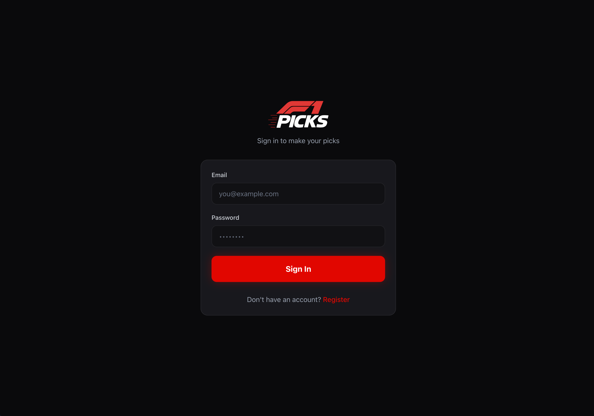
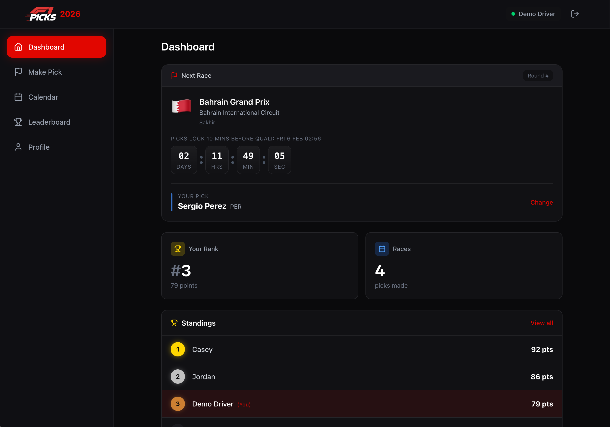
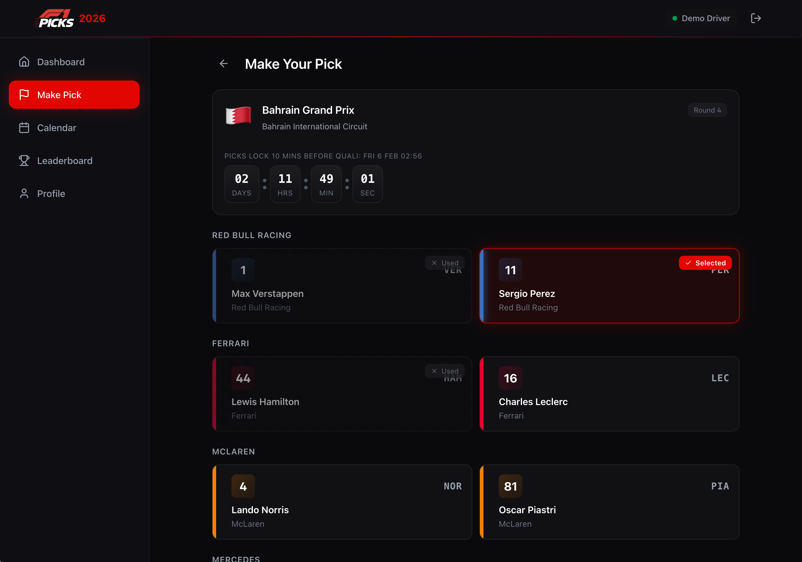
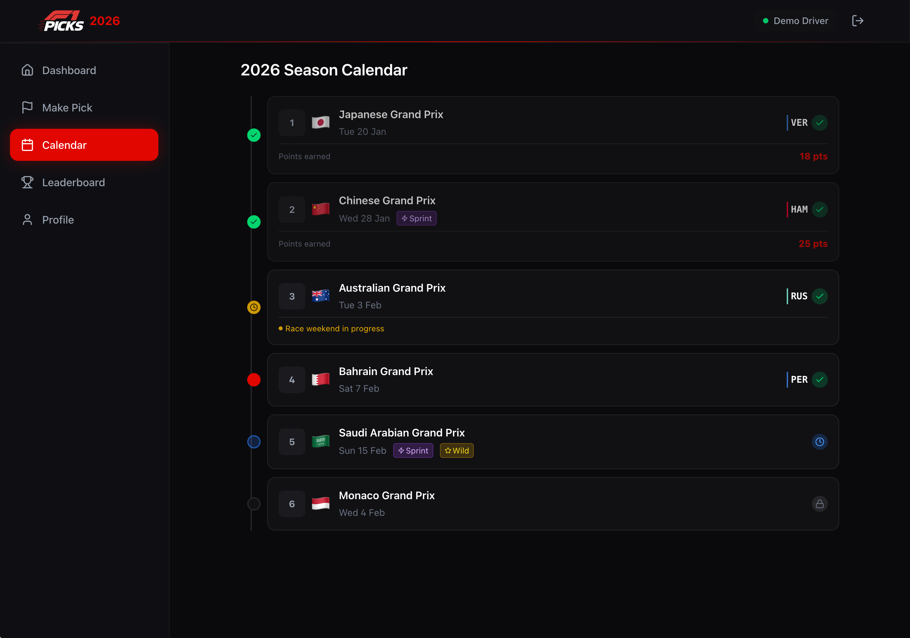

# 🏁 F1 Picks (2026 edition)

_A fresh season, updated rules, same family rivalry._

This is the 2026 edition of the game, continuing from [2025](https://github.com/eddmann/f1-picks-2025). It keeps the spirit of last year while updating the rules for this season.

## Rules (2026 Updates)

### Basic Gameplay

- Pick one driver each race weekend.
- Your driver scores points from the race and the sprint (if there is one).

### Driver Usage

- For the first 22 races, once you've used a driver you cannot pick them again.
- This means you'll end up using all 22 drivers across those races.
- The last 2 races (Qatar and Abu Dhabi) are wild cards: you can pick anyone, even if you used them before.

### Sprint Weekends

- 6 sprint weekends in the season: China, Miami, Canada, Britain, Netherlands, Singapore.
- Your driver scores points from both sprint and race.
- Strong sprint performers are valuable picks on these weekends.

### Pick Deadline

- Normal weekends: picks lock 10 minutes before Qualifying (Saturday).
- Sprint weekends: picks lock 10 minutes before Sprint Qualifying (Saturday morning).
- Pick window opens Monday of race week, so you can watch practice before locking in.

## Scoring

Race points: 25-18-15-12-10-8-6-4-2-1 (P1-10), 0 otherwise.
Sprint points: 8-7-6-5-4-3-2-1 (P1-8), 0 otherwise.

## Quick Start

```bash
make start
```

Common commands:

```bash
make lint
make test
make build
```

Run `make` to see all available targets.

## Demo Mode

Run the UI with in-browser demo data (no backend required):

```bash
VITE_DEMO_MODE=true make start
```

Or use the shorthand:

```bash
make demo
```

Use the Demo Mode buttons on the login screen to pick a scenario (Showcase, New Player, Locked Picks, Admin).

**Screenshots**

| Login                                        | Dashboard                                         |
| -------------------------------------------- | ------------------------------------------------- |
|          |       |
|  |  |

## Architecture

### Client

React + Redux Toolkit + React Router SPA.

- UI and routes live in `src/`.
- API client lives in `src/lib/api.ts` with typed request/response handling.

### API Architecture

Cloudflare Workers + Hono + D1 SQLite, structured as a **layered architecture with manual dependency injection** - three layers with a strict one-way dependency flow:

- Routes: `worker/routes/` (HTTP handlers, validation)
- Use cases: `worker/usecases/` (business logic)
- Repositories: `worker/repositories/` (data access via interfaces)

Use cases declare their dependencies as interfaces (`CreatePickDeps`), and routes wire concrete implementations at call time via factory functions (`createD1UserRepository(env)`). This differs from **hexagonal/ports-and-adapters** which treats driving adapters (HTTP) and driven adapters (database) symmetrically with ports on both sides - here the HTTP layer directly calls use cases with no abstraction. It's simpler than **clean architecture** which prescribes more layers (entities, use cases, interface adapters, frameworks) and stricter isolation rules. And unlike **onion architecture** which emphasises concentric rings with domain at the centre, this has no distinct domain model layer - shared types live in `shared/` and are used directly. The pattern extends to external services (F1 API, clock) which are also injected as interfaces, making everything testable without mocks or network calls. It's a pragmatic middle ground: the key insight from these patterns (depend on abstractions, not implementations) without the ceremony.

## Testing

### Client Testing Strategy

Stack: Bun test runner + Testing Library + MSW.

- UI tests: `src/**/*.test.tsx` (app flows and rendering).
- MSW mocks API responses at the network level.
- Fixtures live in `src/test/fixtures.ts`.

Run:

```bash
make test/client
```

### API Testing Strategy

- Use-case tests: `worker/test/usecases/*.test.ts` (business behavior with in-memory repos and stub services).
- Repository tests: `worker/test/repositories/*.d1.test.ts` (D1 integration tests for SQL implementations).
- HTTP API tests: `worker/test/http/*.http.test.ts` (core request/response paths + auth checks using a real worker + D1).

Run:

```bash
make test/worker
```

## Analysis Notebook

The notebook at [`analysis/picks_analysis.ipynb`](analysis/picks_analysis.ipynb) explores whether historical data can improve pick strategy through the season. The goal is to test whether prior race results, sprint performance, and driver form can help optimize picks while staying within the one-time driver constraint.

For more detail, see [`analysis/`](analysis/).

## License

[MIT License](LICENSE)
